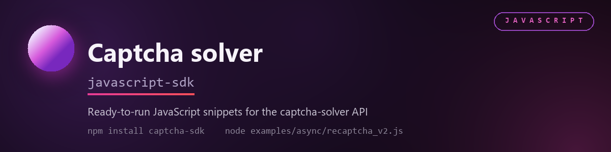

# Captcha Solver JavaScript SDK




Full API reference (all endpoints, error codes, captcha-type details): **https://captcha-solver.com/en/docs/captcha-types**

## Table of Contents

- [Installation](#installation)
- [Configuration](#configuration)
- [Quick Start](#quick-start)
- [Supported CAPTCHA Types](#supported-captcha-types)
- [Client Reference](#client-reference)
  - [CaptchaClient(...)](#captchaclient)
  - [solve(task, languagePool)](#solvetask-languagepool)
  - [createTask(task, languagePool)](#createtasktask-languagepool)
  - [getTaskResult(taskId)](#gettaskresulttaskid)
  - [getBalance()](#getbalance)
- [Captcha Types](#captcha-types)
  - [reCAPTCHA v2](#recaptcha-v2)
  - [reCAPTCHA v2 Enterprise](#recaptcha-v2-enterprise)
  - [reCAPTCHA v3](#recaptcha-v3)
  - [Cloudflare Turnstile](#cloudflare-turnstile)
  - [Image to Text](#image-to-text)
  - [GeeTest (v3 & v4)](#geetest-v3--v4)
  - [Yandex SmartCaptcha](#yandex-smartcaptcha)
  - [Coordinates (click captcha)](#coordinates-click-captcha)
  - [Tencent](#tencent)
- [Advanced Usage](#advanced-usage)
  - [Check balance](#check-balance)
  - [Custom timeout and polling](#custom-timeout-and-polling)
  - [Worker language pool](#worker-language-pool)
  - [Solving multiple captchas in parallel](#solving-multiple-captchas-in-parallel)
  - [Error handling](#error-handling)
  - [TypeScript](#typescript)
- [Running the examples](#running-the-examples)
- [Requirements](#requirements)
- [API Documentation](#api-documentation)
- [License](#license)

## Installation

```bash
npm install captcha-sdk
```

## Configuration

The client always takes the API key as an explicit argument -- it does not read
environment variables on its own. Read `CAPTCHA_API_KEY` yourself and pass it in:

```bash
export CAPTCHA_API_KEY=your_api_key
```

```javascript
import { CaptchaClient } from 'captcha-sdk';
const captchaSolver = new CaptchaClient({ clientKey: process.env.CAPTCHA_API_KEY });
```

Or just pass the key directly, without an environment variable:

```javascript
const captchaSolver = new CaptchaClient({ clientKey: 'your_api_key' });
```

## Quick Start

Solve a reCAPTCHA v2 in 4 lines.

```javascript
import { CaptchaClient, Tasks } from 'captcha-sdk';
const captchaSolver = new CaptchaClient({ clientKey: 'your_api_key' });
const task = new Tasks.RecaptchaV2Proxyless({
  websiteURL: 'https://example.com/login',
  websiteKey: 'YOUR_WEBSITE_KEY'
});
const result = await captchaSolver.solve(task);
console.log(result.gRecaptchaResponse);
```

Runnable versions of every example below live in [examples/async](examples/async) (async/await
style) and [examples/sync](examples/sync) (promise-chain style, `.then()/.catch()`) -- both call
the same `CaptchaClient`, since JavaScript has no blocking HTTP client to mirror `requests` vs.
`httpx` the way the Python SDK does. See [Running the examples](#running-the-examples).

## Supported CAPTCHA Types

| Type | Proxyless | With Proxy |
|---|---|---|
| reCAPTCHA v2 | ✅ | ✅ |
| reCAPTCHA v2 Enterprise | ✅ | ✅ |
| reCAPTCHA v3 | ✅ | ❌ |
| Cloudflare Turnstile | ✅ | ✅ |
| GeeTest v3 | ✅ | ✅ |
| GeeTest v4 | ✅ | ✅ |
| Image to Text | ✅ | ❌ |
| Yandex SmartCaptcha | ✅ | ✅ |
| Coordinates (click captcha) | ✅ | ❌ |
| Tencent | ✅ | ✅ |

### Other supported API task types

Use `GenericTask` for any task type supported by the API that does not have a dedicated convenience class:

```javascript
const task = new Tasks.GenericTask({
  type: 'HCaptchaTaskProxyless',
  websiteURL: 'https://example.com',
  websiteKey: 'YOUR_WEBSITE_KEY'
});

const solution = await captchaSolver.solve(task);
```

`GenericTask` preserves every supplied API field and removes only `null` and `undefined` values.

## Client Reference

The methods and task classes below form the public SDK API. This section provides a quick reference without leaving the README.

### `CaptchaClient(...)`

Constructor. Takes a single options object.

| Option | Type | Default | Description |
|---|---|---|---|
| `clientKey` | `string` | required | Your Captcha Solver API key. Throws `ValidationError` if empty. |
| `baseUrl` | `string` | `https://api.captcha-solver.com` | API base URL. Override only for self-hosted/staging deployments. |
| `timeout` | `number` | `120000` | Default max milliseconds `solve()` waits for a solution before throwing `TimeoutError`. |
| `pollingInterval` | `number` | `5000` | Milliseconds between `getTaskResult` polls inside `solve()`. |

There's no manual connection pool to open or close -- `fetch` (via Node's built-in
`undici`) already reuses keep-alive connections per host automatically, unlike Python's
`requests`/`httpx`, which need an explicit `Session`/`AsyncClient` instance to do the same.

### `solve(task, languagePool)`

The main entry point. Submits `task`, polls until it's solved, and returns the
solution -- wraps `createTask()` + `getTaskResult()` so you don't poll by hand.

| Parameter | Type | Description |
|---|---|---|
| `task` | task object | One of the classes from `Tasks` (see [Captcha Types](#captcha-types)). |
| `languagePool` | `string \| null` | Optional worker pool selector, `'en'` or `'ru'`. Defaults to `null` (account default pool). |

Returns a `Promise` resolving to the `solution` object once `status` is `'ready'` --
its shape depends on the task type (see [Captcha Types](#captcha-types)).
Rejects with `ApiError`, `TimeoutError`, or `NetworkError`.

### `createTask(task, languagePool)`

Submits `task` and returns a `Promise` resolving to its numeric task ID, without
waiting for a solution. Same parameters as `solve()`. Use this instead of `solve()`
only if you need to manage polling yourself (e.g. checking on many tasks from a
different process). Rejects with `ApiError`, `NetworkError`.

### `getTaskResult(taskId)`

Fetches the current status of a task created with `createTask()`. Resolves to an
object with a `status` key (`'processing'` or `'ready'`); when `'ready'`, also has a
`solution` object. This is a single poll, not a wait -- call it repeatedly (as
`solve()` does) until `status` is `'ready'`. Rejects with `ApiError`, `NetworkError`.

### `getBalance()`

Returns a `Promise` resolving to the account's current balance (`number`) in the
account's currency. Rejects with `ApiError`, `NetworkError`.

## Captcha Types

Each section below covers one captcha type end-to-end: task fields, the `solution`
shape, a runnable example, and a link to the full spec. Optional fields left unset
are omitted from the request. Every code block matches a runnable file under
[examples/async](examples/async) (and its [examples/sync](examples/sync) counterpart)
-- swap the placeholder `websiteURL`/`websiteKey`/etc. for values from your own
target page before running. See [Running the examples](#running-the-examples).

Types with a `*` counterpart (as opposed to `*Proxyless`) also accept `proxyType` /
`proxyAddress` / `proxyPort` / `proxyLogin` / `proxyPassword` to solve through your
own proxy instead of the service's IPs.

### reCAPTCHA v2

<sup>[API method description.](https://captcha-solver.com/en/docs/captcha-types#recaptcha-v2)</sup>

Use this method to solve reCAPTCHA v2 and obtain a token for the target page.
Choose the proxy variant when the solving session must use your own IP address.

`Tasks.RecaptchaV2Proxyless` (no proxy) / `Tasks.RecaptchaV2` (with proxy).

| Field | Required | Description |
|---|---|---|
| `websiteURL` | yes | Full URL of the page where the captcha is located. |
| `websiteKey` | yes | Value of the widget's `data-sitekey` attribute. |
| `isInvisible` | no | `true` for invisible reCAPTCHA v2. |
| `recaptchaDataSValue` | no | The `data-s` value, found on Google Search/YouTube pages. |
| `apiDomain` | no | Non-default domain the widget's script is served from, if any. |
| `userAgent` | no | User-Agent to solve with. Recommended to match the agent submitting the token. |
| `cookies` | no | Session cookies to use while solving, if the page requires them. |

**Response:** `gRecaptchaResponse` -- submit as `g-recaptcha-response`.

```javascript
import { CaptchaClient, Tasks } from 'captcha-sdk';
const captchaSolver = new CaptchaClient({ clientKey: 'your_api_key' });
const task = new Tasks.RecaptchaV2Proxyless({
  websiteURL: 'https://example.com/login',
  websiteKey: 'YOUR_WEBSITE_KEY'
});
const result = await captchaSolver.solve(task);
console.log(result.gRecaptchaResponse);
```

With proxy, use `Tasks.RecaptchaV2` instead:

```javascript
const task = new Tasks.RecaptchaV2({
  websiteURL: 'https://example.com/login',
  websiteKey: 'YOUR_WEBSITE_KEY',
  proxyType: 'http',
  proxyAddress: '1.2.3.4',
  proxyPort: 8080,
  proxyLogin: 'user',
  proxyPassword: 'password'
});
```

### reCAPTCHA v2 Enterprise

<sup>[API method description.](https://captcha-solver.com/en/docs/captcha-types#recaptcha-v2-enterprise)</sup>

Use this method to solve the Enterprise version of reCAPTCHA v2 and obtain a
token for a page that uses `grecaptcha.enterprise`.

`Tasks.RecaptchaV2EnterpriseProxyless` / `Tasks.RecaptchaV2Enterprise`. Same fields
as reCAPTCHA v2, plus:

| Field | Required | Description |
|---|---|---|
| `enterprisePayload` | no | Extra parameters passed to `grecaptcha.enterprise.render` on the page, e.g. `{ s: '...' }`. |
| `apiDomain` | no | Defaults to `google.com`. |

**Response:** `gRecaptchaResponse`.

```javascript
import { CaptchaClient, Tasks } from 'captcha-sdk';
const captchaSolver = new CaptchaClient({ clientKey: 'your_api_key' });
const task = new Tasks.RecaptchaV2EnterpriseProxyless({
  websiteURL: 'https://example.com/login',
  websiteKey: 'YOUR_WEBSITE_KEY'
});
const result = await captchaSolver.solve(task);
console.log(result.gRecaptchaResponse);
```

With proxy, use `Tasks.RecaptchaV2Enterprise` (same proxy fields as reCAPTCHA v2).


### reCAPTCHA v3

<sup>[API method description.](https://captcha-solver.com/en/docs/captcha-types#recaptcha-v3)</sup>

Use `Tasks.RecaptchaV3Proxyless` for score-based reCAPTCHA v3. The API supports
this task only without a customer proxy.

| Field | Required | Description |
|---|---|---|
| `websiteURL` | yes | Full URL of the page where the captcha is located. |
| `websiteKey` | yes | Site key for the reCAPTCHA v3 widget. |
| `minScore` | yes | Minimum token score, for example `0.3`, `0.7`, or `0.9`. |
| `pageAction` | no | Action passed to `grecaptcha.execute()` on the page. |
| `isEnterprise` | no | Set to `true` for reCAPTCHA v3 Enterprise. |
| `apiDomain` | no | Alternative domain used to load the reCAPTCHA script. |

**Response:** `gRecaptchaResponse`.

```javascript
import { CaptchaClient, Tasks } from 'captcha-sdk';

const captchaSolver = new CaptchaClient({ clientKey: 'your_api_key' });
const task = new Tasks.RecaptchaV3Proxyless({
  websiteURL: 'https://example.com/login',
  websiteKey: 'YOUR_WEBSITE_KEY',
  minScore: 0.3,
  pageAction: 'homepage'
});

const result = await captchaSolver.solve(task);
console.log(result.gRecaptchaResponse);
```

### Cloudflare Turnstile

<sup>[API method description.](https://captcha-solver.com/en/docs/captcha-types#cloudflare-turnstile)</sup>

Use this method to solve a Cloudflare Turnstile widget and obtain the token
that the target page expects in `cf-turnstile-response`.

`Tasks.TurnstileProxyless` / `Tasks.Turnstile`.

| Field | Required | Description |
|---|---|---|
| `websiteURL` | yes | Full URL of the page where the widget is located. |
| `websiteKey` | yes | Value of the widget's `data-sitekey` attribute. |
| `action` | no | Value of the widget's `data-action` attribute, if set. |
| `data` | no | Custom payload from the widget's `data-cdata` attribute, if set. |
| `pagedata` | no | Value of the `chlPageData` parameter, needed for some Cloudflare challenge pages beyond the basic widget. Note the lowercase, single-word spelling -- unlike every other field on this page, the real API does not accept `pageData`. |

There's no `userAgent` input for this type -- the worker picks its own while solving
and returns it in the response instead (see below).

**Response:** `token` -- submit as `cf-turnstile-response` -- and `userAgent`, the User-Agent the
worker actually solved with. The token is tied to that fingerprint, so submit it with that exact
User-Agent, not one you chose yourself.

```javascript
import { CaptchaClient, Tasks } from 'captcha-sdk';
const captchaSolver = new CaptchaClient({ clientKey: 'your_api_key' });
const task = new Tasks.TurnstileProxyless({
  websiteURL: 'https://example.com/login',
  websiteKey: 'YOUR_WEBSITE_KEY'
});
const result = await captchaSolver.solve(task);
console.log(result.token);
```

With proxy, use `Tasks.Turnstile` (same proxy fields as reCAPTCHA v2).

### Image to Text

<sup>[API method description.](https://captcha-solver.com/en/docs/captcha-types#image-to-text)</sup>

Use this method to recognize text, numbers, or simple math expressions in an
image captcha. The image is sent directly and does not require a proxy.

`Tasks.ImageToText`. No proxy variant -- the image is submitted directly, no
browser session involved.

| Field | Required | Description |
|---|---|---|
| `body` | yes | The captcha image, base64-encoded (no `data:image/...;base64,` prefix). |
| `phrase` | no | `true` if the answer is multiple words. |
| `case_` | no | `true` if the answer is case-sensitive. Serializes to the `case` field (renamed to work around the reserved word). |
| `numeric` | no | `0` unspecified, `1` digits only, `2` letters only, `3` any with digits, `4` any with letters. |
| `math` | no | `true` if the image contains a math expression to evaluate. |
| `minLength` / `maxLength` | no | Expected answer length bounds. |
| `comment` | no | Free-text hint for the worker. |
| `imgInstructions` | no | Optional supplementary instruction image, base64-encoded. |

**Response:** `text` -- the recognized text/answer.

```javascript
import { CaptchaClient, Tasks } from 'captcha-sdk';
import fs from 'fs';
const imageBase64 = fs.readFileSync('examples/assets/text-captcha.png').toString('base64');
const captchaSolver = new CaptchaClient({ clientKey: 'your_api_key' });
const task = new Tasks.ImageToText({
  body: imageBase64,
  numeric: 2,
  minLength: 4,
  maxLength: 6
});
const result = await captchaSolver.solve(task);
console.log(result.text);
```

### GeeTest (v3 & v4)

<sup>[API method description: v3](https://captcha-solver.com/en/docs/captcha-types#geetest-v3), [v4](https://captcha-solver.com/en/docs/captcha-types#geetest-v4)</sup>

Use this method to solve GeeTest puzzle captchas. Select version 3 or 4 and
pass the values collected from the target page before creating the task.

`Tasks.GeeTestProxyless` / `Tasks.GeeTest`. Set `version: 4` for v4 (with
`initParameters.captcha_id`); v3 is the default and needs `gt`/`challenge` instead.

| Field | Required | Description |
|---|---|---|
| `websiteURL` | yes | Full URL of the page where the widget is located. |
| `version` | no | `3` (default) or `4`. |
| `gt` | v3 only | Public key of the GeeTest widget. |
| `challenge` | v3 only | Session-specific challenge value from the page -- must be freshly fetched for every request, it cannot be reused. |
| `initParameters` | v4 only | Extra parameters from the page's `initGeetest` call; for v4 must contain `captcha_id`. |
| `geetestApiServerSubdomain` | no | Custom GeeTest API subdomain, if the site uses one. |
| `userAgent` | no | User-Agent to solve with. |
| `risk_type` | no | Dynamic, single-use value included in the page's captcha-loading request, if present. Note the snake_case name -- unlike every other field here, the real API does not accept `riskType`. |

**Response:** v3 -- `challenge`, `validate`, `seccode`. v4 -- `captcha_id`, `lot_number`, `pass_token`, `gen_time`, `captcha_output`.
Docs: [v3 ↗](https://captcha-solver.com/en/docs/captcha-types#geetest-v3), [v4 ↗](https://captcha-solver.com/en/docs/captcha-types#geetest-v4)

```javascript
import { CaptchaClient, Tasks } from 'captcha-sdk';
const captchaSolver = new CaptchaClient({ clientKey: 'your_api_key', timeout: 300000, pollingInterval: 10000 });
const task = new Tasks.GeeTestProxyless({
  websiteURL: 'https://example.com/login',
  gt: 'f2ae6cadcf7886856696c46d84d109d1',
  challenge: '12345678abc90123d45678e90123f45g6' // dynamic -- fetch a fresh one per request
});
const result = await captchaSolver.solve(task);
console.log(result.validate);
console.log(result.seccode);
```
`challenge` is session-specific and expires quickly, so it can't be hardcoded into a
static example -- see [examples/async/geetest_v3.js](examples/async/geetest_v3.js) for
where the fetch belongs in the flow.

```javascript
const task = new Tasks.GeeTestProxyless({
  websiteURL: 'https://example.com/login',
  version: 4,
  initParameters: { captcha_id: 'YOUR_CAPTCHA_ID' }
});
const result = await captchaSolver.solve(task);
console.log(result.captcha_output);
```

With proxy, use `Tasks.GeeTest` (same proxy fields as reCAPTCHA v2).

### Yandex SmartCaptcha

<sup>[API method description.](https://captcha-solver.com/en/docs/captcha-types#yandex-smartcaptcha)</sup>

Use this method to solve the token-based Yandex SmartCaptcha and obtain a token
for the widget on the target page. Use the coordinates method for image challenges.

`Tasks.YandexSmartCaptchaTaskProxyless` / `Tasks.YandexSmartCaptchaTask` -- token-based
challenge. For the image challenge instead, use `Tasks.CoordinatesTask` with

| Field | Required | Description |
|---|---|---|
| `websiteURL` | yes | Full URL of the page where the widget is located. |
| `websiteKey` | yes | The `sitekey` value from the page source or captcha iframe. |
| `userAgent` | no | User-Agent to solve with. |
| `cookies` | no | Session cookies to use while solving, if the page requires them. |

Proxy variant note: `proxyType` also accepts `'https'` for this captcha type only
(in addition to `http`/`socks4`/`socks5`).

**Response:** `token`.

```javascript
import { CaptchaClient, Tasks } from 'captcha-sdk';
const captchaSolver = new CaptchaClient({ clientKey: 'your_api_key' });
const task = new Tasks.YandexSmartCaptchaTaskProxyless({
  websiteURL: 'https://example.com/login',
  websiteKey: 'YOUR_WEBSITE_KEY'
});
const result = await captchaSolver.solve(task);
console.log(result.token);
```

With proxy, use `Tasks.YandexSmartCaptchaTask` (same proxy fields as reCAPTCHA v2,
plus the `https` option above).

### Coordinates (click captcha)

<sup>[API method description.](https://captcha-solver.com/en/docs/captcha-types#coordinates)</sup>

Use this method to identify points that a worker should click in an image. It
supports generic click captchas and the image version of Yandex SmartCaptcha.

`Tasks.CoordinatesTask`. Used both for generic "click on X" captchas and for
directly.

| Field | Required | Description |
|---|---|---|
| `body` | yes | The captcha image, base64-encoded. |
| `comment` | no (recommended) | Hint for the worker, e.g. `'click on the green apple'`. |
| `minClicks` | no | Minimum number of clicks expected (default `1`). |
| `maxClicks` | no | Maximum number of clicks allowed. |

**Response:** `coordinates` -- an array of `{ x, y }` pixel positions to click, in order.

```javascript
import { CaptchaClient, Tasks } from 'captcha-sdk';
import fs from 'fs';
const body = fs.readFileSync('examples/assets/coordinates-captcha.png').toString('base64');
const captchaSolver = new CaptchaClient({ clientKey: 'your_api_key' });
const task = new Tasks.CoordinatesTask({
  body: body,
  comment: 'click on the green apple'
});
const result = await captchaSolver.solve(task);
console.log(result.coordinates); // [{ x: 358, y: 268 }]
```
mode" block in [examples/async/coordinates.js](examples/async/coordinates.js) (or
[examples/sync/coordinates.js](examples/sync/coordinates.js)).

### Tencent

<sup>[API method description.](https://captcha-solver.com/en/docs/captcha-types#tencent)</sup>

Use this method to solve Tencent Captcha and obtain the ticket and callback
values required by the target page.

`Tasks.TencentTaskProxyless` / `Tasks.TencentTask`.

| Field | Required | Description |
|---|---|---|
| `websiteURL` | yes | Full URL of the page where the captcha is located. |
| `appId` | yes | Value of the `appId` parameter found in the page source. |
| `captchaScript` | no | URL of the Tencent captcha script, if the page uses a non-default one. |

**Response:** `appid`, `ret`, `ticket`, `randstr` -- pass all four into the page's Tencent captcha callback.

```javascript
import { CaptchaClient, Tasks } from 'captcha-sdk';
const captchaSolver = new CaptchaClient({ clientKey: 'your_api_key' });
const task = new Tasks.TencentTaskProxyless({
  websiteURL: 'https://example.com/register',
  appId: 'YOUR_APP_ID'
});
const result = await captchaSolver.solve(task);
console.log(result.ticket);
```

With proxy, use `Tasks.TencentTask` (same proxy fields as reCAPTCHA v2).

## Advanced Usage

### Check balance

```javascript
import { CaptchaClient } from 'captcha-sdk';
const captchaSolver = new CaptchaClient({ clientKey: 'your_api_key' });
const balance = await captchaSolver.getBalance();
console.log(`Balance: ${balance}`);
```

### Custom timeout and polling

```javascript
const captchaSolver = new CaptchaClient({
  clientKey: 'your_api_key',
  timeout: 180000,
  pollingInterval: 5000
});
```

### Worker language pool

Pass `languagePool` as the second argument to `solve()` (or `createTask()`) to pick a
worker pool by language. Accepted values: `'en'` or `'ru'`.

```javascript
const result = await captchaSolver.solve(task, 'en');
```

### Solving multiple captchas in parallel

`CaptchaClient` is promise-based throughout, so running several `solve()` calls
concurrently is just `Promise.all()` -- no separate async client needed:

```javascript
import { CaptchaClient, Tasks } from 'captcha-sdk';
const captchaSolver = new CaptchaClient({ clientKey: 'your_api_key' });

const task1 = captchaSolver.solve(new Tasks.RecaptchaV2Proxyless({ websiteURL: 'https://site1.com', websiteKey: 'key1' }));
const task2 = captchaSolver.solve(new Tasks.TurnstileProxyless({ websiteURL: 'https://site2.com', websiteKey: 'key2' }));

const results = await Promise.allSettled([task1, task2]);
```
This completes in roughly the time of the slowest single captcha, not the sum of all of them.

### Error handling

```javascript
import { CaptchaClient, ApiError, TimeoutError, NetworkError, ValidationError } from 'captcha-sdk';
const captchaSolver = new CaptchaClient({ clientKey: 'your_api_key' });
try {
  const result = await captchaSolver.solve(task);
} catch (error) {
  if (error instanceof ValidationError) {
    console.log(`Invalid input: ${error.message}`);
  } else if (error instanceof ApiError) {
    console.log(`API error: ${error.errorCode} ${error.errorDescription}`);
  } else if (error instanceof TimeoutError) {
    console.log('Task timed out');
  } else if (error instanceof NetworkError) {
    console.log(`Network error: ${error.message}`);
  }
}
```

### TypeScript

The package ships its own type declarations, so no `@types/*` install is needed.
Every task constructor takes a typed options object, and `solve()` infers the
solution type from the task class:

```typescript
import { CaptchaClient, Tasks } from 'captcha-sdk';
import type { TurnstileSolution } from 'captcha-sdk';

const captchaSolver = new CaptchaClient({ clientKey: 'your_api_key' });

const result = await captchaSolver.solve(new Tasks.TurnstileProxyless({
  websiteURL: 'https://example.com/login',
  websiteKey: 'YOUR_WEBSITE_KEY'
}));
result.token;      // string
result.userAgent;  // string

// The same shape is exported by name if you need to pass it around.
const stored: TurnstileSolution = result;
```

Parameter types (`RecaptchaV2Params`, `GeeTestProxylessParams`, ...) and solution
types (`RecaptchaSolution`, `GeeTestSolution`, ...) are exported from the package
root. `GenericTask` resolves to a plain `Record<string, unknown>`. Every public
class, method and field carries JSDoc, so hover documentation in the editor
matches this README.

## Running the examples

- **Image/click captchas** (`image_to_text.js`, `coordinates.js`) run end-to-end
  with nothing but a valid `CAPTCHA_API_KEY` -- they read sample images bundled in
  [examples/assets](examples/assets), no target page needed.
  `turnstile.js`, `yandex_smartcaptcha.js`, `geetest_v4.js`, `tencent.js`) use
  placeholder values (`https://example.com/...`, `YOUR_WEBSITE_KEY`, `YOUR_APP_ID`,
  `YOUR_CAPTCHA_ID`) -- replace these with the real values from your own target
  page before running.
- **`geetest_v3.js`** additionally needs `challenge` fetched fresh for every
  request -- it's single-use and expires within seconds, so it can't be
  hardcoded into a static example. `'https://target-site.com/path/to/geetest/init'`
  is a placeholder; replace it with a request to your own target's equivalent
  endpoint (or wherever it exposes `gt`/`challenge`) -- see the script for where
  that fetch belongs in the flow.
- **Proxy variants** (`Tasks.*` classes without `Proxyless` in the name) use
  placeholder proxy credentials (`1.2.3.4` / `user` / `password`) in every example
  file -- proxies are a paid, account-specific resource, so there's nothing public
  to ship here. Swap in your own proxy details to run those blocks for real.

```bash
export CAPTCHA_API_KEY=your_api_key
node examples/async/balance.js
node examples/async/image_to_text.js
node examples/async/coordinates.js
```

Full details, an example index, and a per-type breakdown of what each script
covers live in [examples/README.md](examples/README.md).

## Requirements

- Node.js 18 or newer. Modern browser with fetch support.
- Captcha Solver account with a valid API key.

## API Documentation

Full API reference: https://captcha-solver.com/en/docs/captcha-types

## License

This project is licensed under the MIT License. See [LICENSE.md](LICENSE.md) for details.
